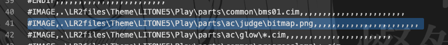

日本語のREADMEは[こちら](./README_jp.md)

# Corn_Judge
huequica's original judge for [LITONE5](https://desout2.tk/litone5-beatoraja/)  
(and other release?)

# Warning
**Use this at your own risk.**

# demo

# Credit
+ [Corner font](http://www.cfont.jp/eijifree/corner.html)
  + Used this font
+ [It Wasn't Me](https://www.nicovideo.jp/watch/sm35954548)
  + Allowed to reference

# How to use
1. Clone this repos.(or download repos zip.)
2. Copy [judge image](./judge/png/corn.png) file at `$(beatoraja root)/skin/LITONE5/Play/parts/ac/judge`
3. Open a csv file at `$(beatoraja root)/skin/LITONE5/Play/csv/$(your playside file).csv`
4. Modify judge file specify.(It's easy to search for the word `judge` in csv file.)

5. Enjoy!

# LICENSE 
This Asset Files are apply CC4.0.