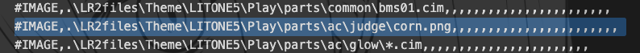

English README is [here](./README.md)

# Corn_Judge
[LITONE5](https://desout2.tk/litone5-beatoraja/)用の差分判定文字です。
(後続のバージョンでも使えるかも？確認はしてないです)

# Credit
[Corner font](http://www.cfont.jp/eijifree/corner.html)

この判定文字の作成に際し利用させていただきました。  
ありがとうございます。

# How to use
1. リポジトリをクローンしてください。(もしくはzipでダウンロード)
2. `$(beatoraja root)/skin/LITONE5/Play/parts/ac/judge` に[判定文字画像](./judge/png/corn.png)をコピーしてください。
3. `$(beatoraja root)/skin/LITONE5/Play/csv/$(設定しているプレイサイド).csv`を適当なエディタで開いてください。
4. 記述を一部変更してください。(`judge` で検索すると見つけるのが楽です。)

5. 終了です。いっぱい使ってあげてください。

# LICENSE 
このリポジトリのファイルはすべてCC4.0にて公開します。